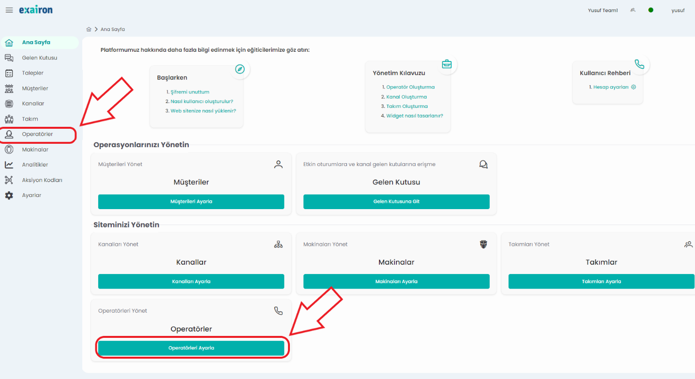
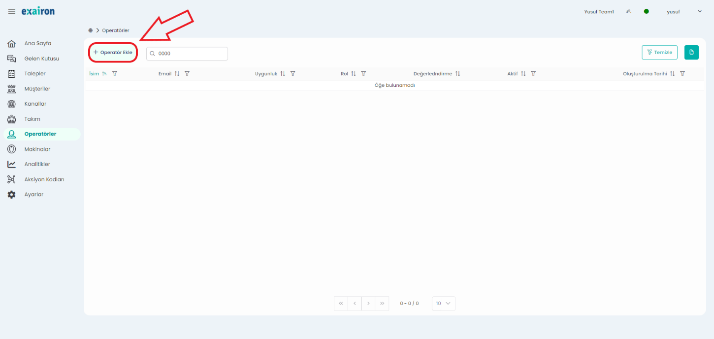
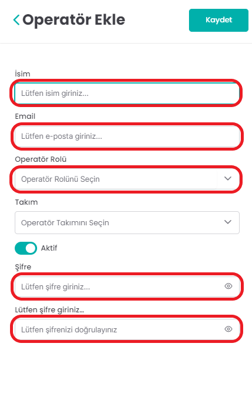

# Operatör Ekleme

Operatör eklemek, sistemi kullanmasını istediğiniz çalışanlarınıza sisteme giriş yetkisi tanımlanıdığınız alandır. Öncelikle bu ekrana gidebilmek için yapmanız gereken ilk adım sol taraftaki panelden ‘Operatörler’ penceresine tıklamak veya sayfanın altındaki ‘Operatörleri Ayarla’ butonuna tıklamak.

İkinci adım ise açılan pencerede sol üst köşede gösterilen ‘Operatör Ekle’ butonuna tıklamak.

Son adım ise sağ tarafta açılan pencerede operatör bilgilerini girmek. İsim, email, operatör rolü, ve şifre bilgilerini girmek operatör eklemek için gereklidir. Operatör rolü için ise yetkilendirmeye(erişilebilen ekranlara göre) ‘Admin, Operatör ve Supervisor’ olarak 3 yetkiden oluşmaktadır.

Girdiğiniz email ve şifre ile çalışanlarınız, https://dev2.services.exairon.com/ bağlantısından giriş yapabilirler. Takım yaratma adımı ile devam edebilirsiniz.