#   Makineler

Makineler diyaloglardaki niyetleri algılayarak, bu niyetler doğrultusunda cevap aksiyolarının oluşturulduğu ekranlardır. Yani, makineniz yapay zeka ile müşteri mesajının anlatmak istediğini algılar sonrasında bu diyalog ile alakalı aksiyonu müşterinize iletmenizi sağlar.

Makine ekranında ana işlevi yapan 4 adet temel fonksiyonu mevcut.
<ol>
  <li>Konular</li>
  <li>Aksiyonlar</li>
  <li>Diyalog Tasarımı</li>
  <li>Makina Eğitmek</li>
</ol>

## Konular 
Konular bir konuşma esnasında müşteri talebibinin anlaşılması için sistemimize daha önceden tanımladığımız kelime ve cümle öbekleridir. Amacımız yapay zeka bu öbeklerin aynısı veya benzerleriyle karşılaştığında bu öbekleri tanımasını sağlamaktır.

Örneğin: Müşterilerinizden birinin öncelikle size ‘Merhaba’ diyerek bir konuşmaya başladığını düşünelim.

Bu konuları ‘Karşılama’ başlığı altında toplayalım.

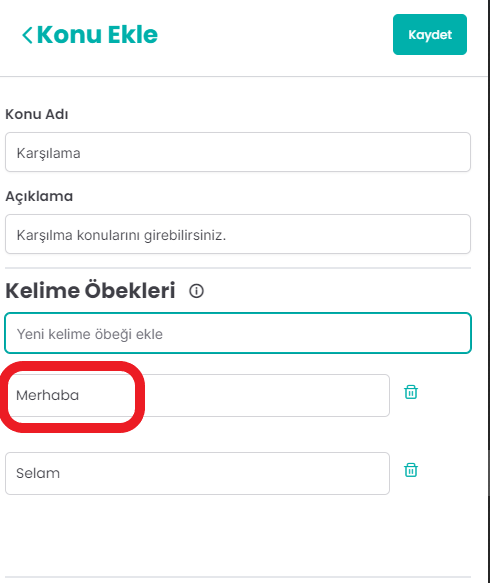

Yukarıda görüldüğü gibi artık kullanıcı ‘Selam’ veya ‘Merhaba’ yazdığında artık Makinamız bunun ‘Karşılama’ konusu olduğunu tanıyacak. Bundan sonraki aşamada ise bir cevap aksiyonu oluşturacağız.

## Aksiyonlar
Aksiyonlar cevap verme yapısının oluşturulduğu ekranlardır. Kullanıcıya ‘Hoş geldiniz, size nasıl yardımcı olabilirim?’ diye bir metin cevabı oluşturmak istiyorsunuz. Bunun için yapmanız gereken ilk adım Makina ekranında Aksiyonlar pencerisine tıklamak. Sonrasında ise aksiyon tipi olarak cevabı, yanıt tipi olarak ise Texti seçmeniz gerekmektedir. Sonrasında ise dilediğiniz metin cevabını mesaj kusunun içine yazabilirsiniz.

Örneğin: Müşterileri karşılmak için yukarıda belirttiğimiz ‘Hoş geldiniz, size nasıl yardımcı olabilirim?’ cevabını aşağıdaki görseldeki gibi ekleyebiliriz. Şekilde görüldüğü gibi aksiyonumuzun ismi ‘Karşılama Cevap’ olarak kaydedildi.

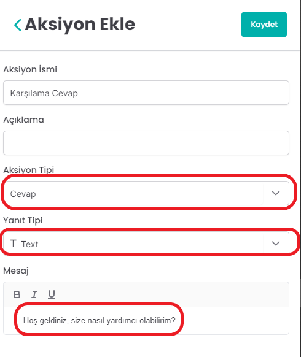

Bir cevabı oluşturduktan sonra Makinamızın hangi konulardan sonra bu cevapları ileteceğini Makinamıza öğretmemiz gerekmektedir. Bunun için Diyalog Tasarımı ekranını kullanacağız. Ayrıca farklı cevap tipleri olarak Carousel, Buton ve Image da tanımlayabiliyoruz bunların ne olduğunu diyalog tasarımı oluşturduktan sonra öğreneceğiz.

## Diyaloglar
Diyaloglar daha önce tanımlamış olduğumuz konular ve cevap aksiyonlarını birleştirdiğimiz ekrandır. Bu ekranda temel olarak Makinamıza bu konuları tanıdığında bu cevapları ilet komutunu tanımlıyoruz. Bunun için yapmamız gereken ilk adım Makina ekranında ‘Diyalog Tasarımı’ penceresine gitmek. Bu pencerede ekranın sol üsttrafında yer alan + butonuna tıklayarak Command seçeneğini seçmek. Sonrasında ise oluşturacağımız komuta bir isim vererek kaydedeceğiz. Sonrasında bizden bir konu seçmemizi isteyecek daha önce tanımlamış olduğumuz konulardan birini seçeceğiz sonrasında ise makinamızın bu konu karşısında vermesini istediğimiz cevabı seçeceğiz ve kaydederek devam edeceğiz.

Örneğin: Öncelikle tanımladığımız ‘Karşılama’ konusunu ‘Karşılama Cevap’ cevabıyla birleştirelim. Bunun için yapmamız gereken ilk adım Makina ekranında ‘Diyalog Tasarımı’ penceresine gitmek. Bu pencerede ekranın sol üsttrafında yer alan + butonuna tıklayarak Command seçeneğini seçmek.

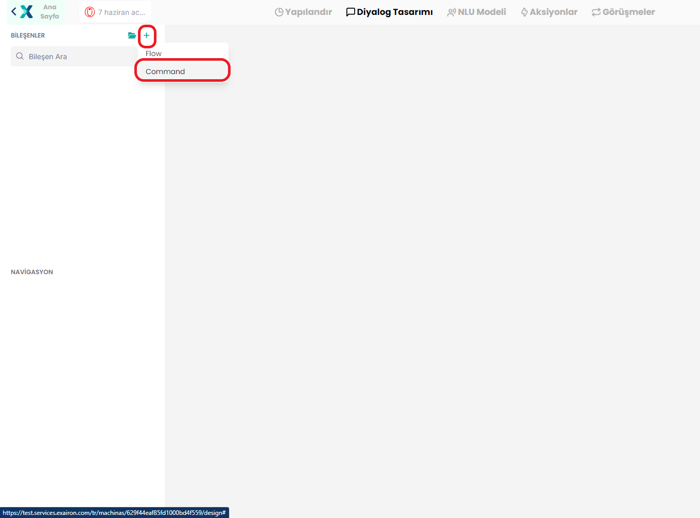

Sonrasında ise oluşturacağımız komuta bir isim vererek kaydedeceğiz.

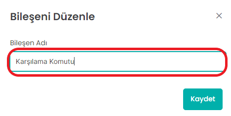

Bir sonraki aşamada bizden blok ismi soracak ve bloğumuza bir isim vererek devam edeceğiz.

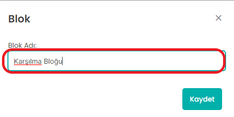

Blok adımızı girdikten sonra Makinamızın eşleştirmesini istediğimiz ‘Karşılama’ konusunu seçeceğiz.

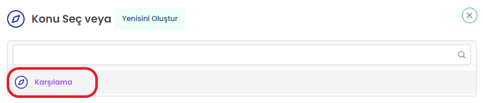

Sonrasında ise bir cevap eklemek için faremizi karşılama içeriğinin altına sürükleyerek ‘Yeni Öğe Ekle’ kısmına tıklıyoruz.

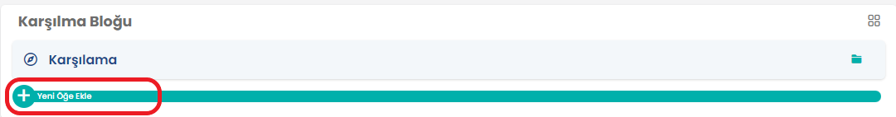

Sonrasında ise açılan menüden ‘Yanıtla’ seçeneğini seçiyoruz

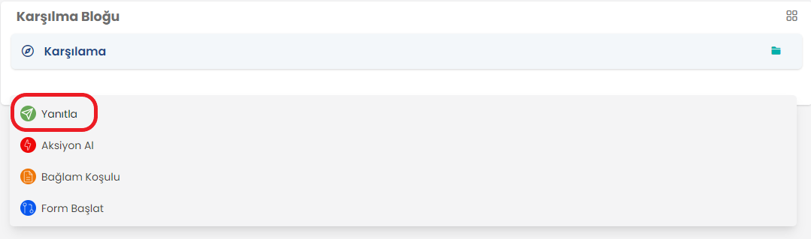

Sonrasında karşımızda açılan yanıtlar penceresinden ‘Karşılama Cevap’ aksiyonunu seçiyoruz.

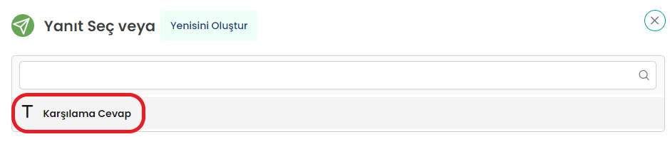

Son olarak Ekranının üst tarafında yer alan kaydet butonuna tıklayarak komutunuzu kaydediyorsunuz.

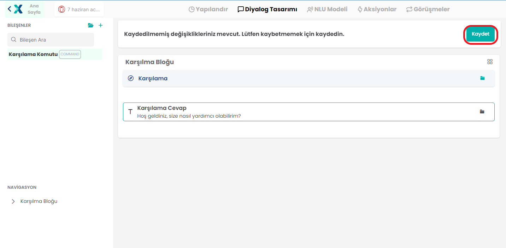

## Makina Eğitmek

Yaptığımız değişiklikleri Makinamıza öğretmemiz gerekmektedir. Bunun için ilk olarak sağ üst taraftan ‘Eğit’ butonuna tıklamak.

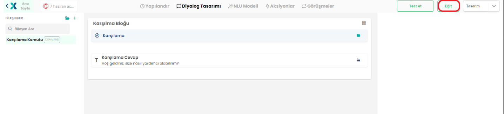

Sonrasında ise gelen bildirimlerde modellere git diyerek aktif olarak oluşturulan modelimizi şekildeki butona tıklayarak aktif etmek.

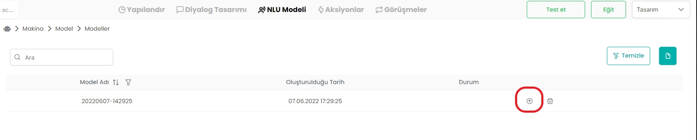

Sonrasında ise sağ üst taraftaki ‘Test Et’ butonuna tıklayarak makinamızı tanımladığımız konularla test edebiliriz.

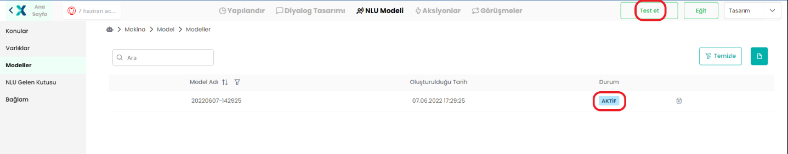

Şimdi ise keyifli kısıma geldik, hadi ‘Merahaba’ yazalım.

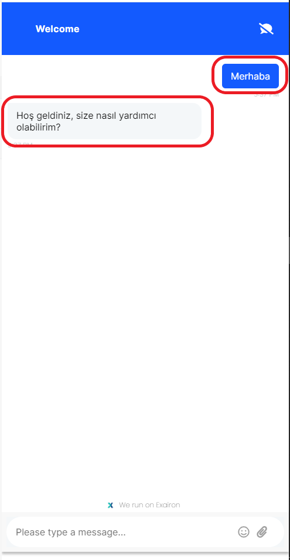

TEBRİKLER! İlk Makinanızı oluşturdunuz, artık Makinanız Merhaba ve Selam içeriklerini gördüğünde müşterinize ‘Hoş geldiniz, size nasıl yardımcı olabilirim?’ diyecek, tadını çıkarın. Sonrasında ise Makina ekranını daha detaylı olarak inceleyeceğiz.